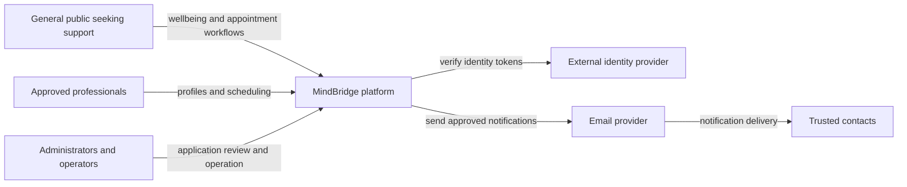
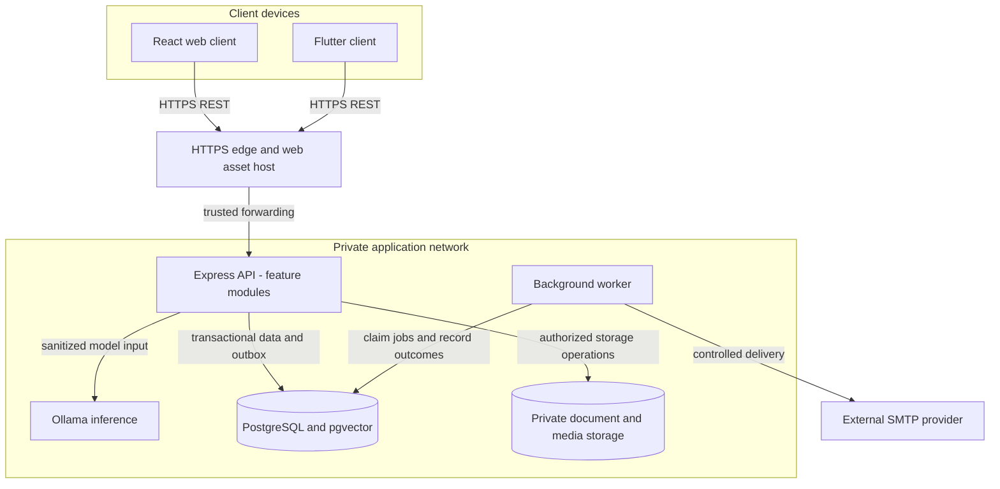
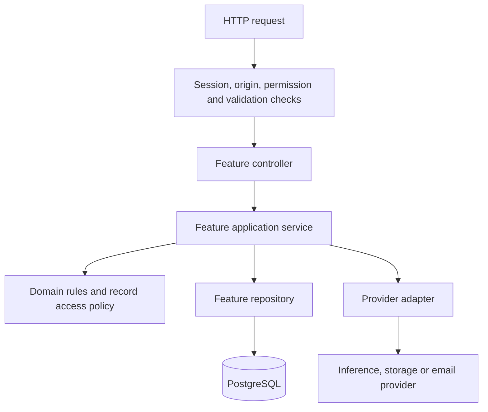
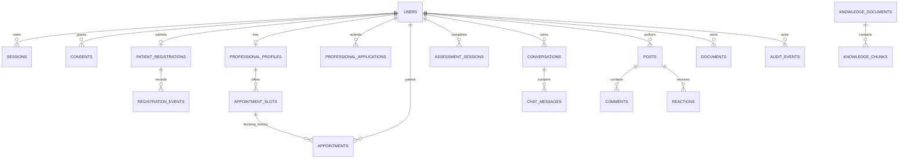
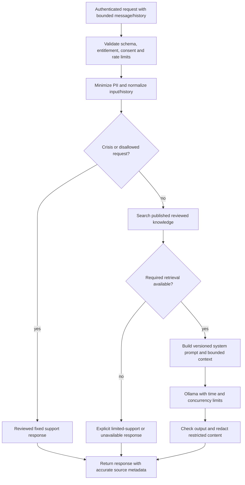
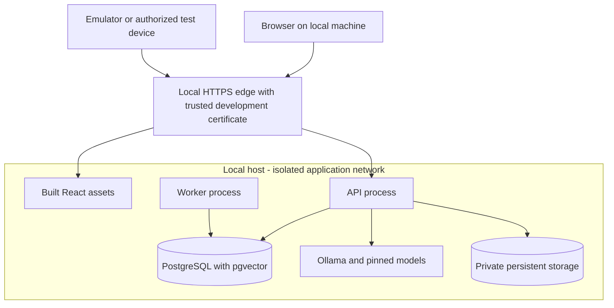
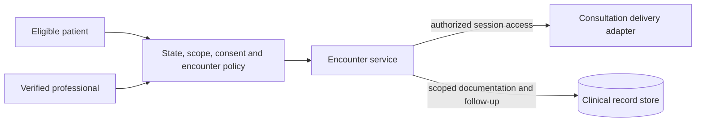

# MindBridge — software architecture blueprint

| Document control | Value |
| --- | --- |
| Version | 1.1 |
| Date | 3 October 2026 |
| Status | Proposed target architecture; ready for review |
| Audience | Developers, project owner, reviewers and future operators |
| Scope | Architecture documentation only |
| Baseline | [Current architecture](CURRENT_ARCHITECTURE.md) |
| Related documents | [Project overview](PROJECT_OVERVIEW.md), [readiness register](PRODUCTION_READINESS.md) |

This blueprint defines how MindBridge should be structured and verified for its intended use. **It does not describe improvements as already implemented, claim production readiness, or authorize code changes.** “Must” defines a requirement of this proposed design; “proposed” identifies a decision or target that still needs project-owner agreement.

## 1. Purpose, audience and constraints

MindBridge brings wellbeing activities, reflective assessments, AI-supported conversation, community interaction and professional appointment access into one platform. Its confirmed audience is the **general public, especially people seeking support for mental health concerns such as depression, mental stress and anxiety**. Existing patient registration restricts the prototype to adults aged 18+. The confirmed target market is the United States, and the target service includes professional consultations and treatment. The initial launch states and disciplines remain open.

Confirmed project constraints:

- Keep this work documentation-only.
- Design for eventual real-user use; the current code remains a prototype.
- Prepare a design that can run locally. No publishing or deployment is requested.
- Retain the existing React web client, Flutter client, Express backend, PostgreSQL and Ollama as the design baseline.
- Actual patient and doctor counts are unknown. Display values are not verified population statistics.

Design assumptions: one platform operated by one team, one primary database, and a small initial curated knowledge base. There is no confirmed multitenancy, hospital integration, payment service, video consultation workflow, or availability contract. Those require separate designs if introduced. Clinical consultation delivery and care records are now required target capabilities; their U.S. onboarding requirements are defined in [US_CLINICAL_REGISTRATION.md](US_CLINICAL_REGISTRATION.md).

The term “patient” refers to an application account role. It does not establish a diagnosis. AI and assessment features have a support role; the architecture does not establish clinical validity or staffed emergency response.

## 2. Architecture decision

**Use a modular monolith for the business backend, with separate inference and background-worker processes.** A modular monolith is one application whose features have explicit internal boundaries and service interfaces.

| Decision | Why it fits MindBridge | Tradeoff |
| --- | --- | --- |
| One modular Express API | Both clients use shared workflows and access policies; registration and booking require reliable transactions | Modules need enforced boundaries to avoid becoming one large route file |
| PostgreSQL as the system of record | Relational identities, review states, appointments and ownership need constraints and transactions | One database requires disciplined schema ownership and backups |
| PostgreSQL with pgvector for target knowledge search | Aligns with the vector operators already used by the retrieval code | Extension, embedding dimensions and compatible runtime must be provisioned and tested |
| Separate Ollama process | Isolates model runtime resources and permits independent model updates | Model availability and latency become explicit dependencies |
| PostgreSQL outbox plus worker | Keeps business changes and notification jobs durable in one transaction | Delivery is at least once; worker retries need duplicate handling |
| Private storage adapter | Documents have different access rules from public community images | File lifecycle and database metadata must be coordinated |
| REST with an OpenAPI contract | Clear shared contract for React and Flutter | Contract changes require versioning and client migration |
| Add infrastructure after measurement | Keeps the initial local system understandable and reproducible | Scale targets must be measured before increasing usage |

The target pgvector dependency provides vector similarity search within PostgreSQL; exact search and indexed search are supported. Begin with exact search for the small corpus and measure before adding approximate indexing. [pgvector documentation](https://github.com/pgvector/pgvector)

This target has **one business API deployment**, not separate services for each feature. A worker can use the same codebase and image with a different entry point. Payment, realtime and hospital integrations are deferred.

## 3. System context



Trusted contacts receive notifications; they have no proposed account role in the initial scope. Email provider acceptance does not prove receipt or a human response.

## 4. Containers and trust boundaries



| Container | Owns | Must not do |
| --- | --- | --- |
| Web client | UI, navigation, input feedback, session presentation | Authorize private data or store sensitive tokens in ordinary browser storage |
| Flutter client | Mobile UI, secure token storage, API interaction | Connect directly to database, storage credentials or Ollama |
| HTTPS edge | TLS, asset delivery, trusted forwarding and request limits | Make business authorization decisions or publicly expose private file roots |
| API | Authentication, authorization, application workflows and synchronous AI orchestration | Assume client-provided identity, role, price, score or ownership is authoritative |
| Worker | Background job claiming, retries and delivery results | Decide appointment availability outside the booking transaction |
| PostgreSQL | Durable records, relationships, constraints, audit events and outbox | Use production data as test fixtures |
| Ollama | Chat/embedding inference using the chosen models | Access the business database or private files directly |
| Storage | File bytes addressed by server-issued keys | Derive access rights from a URL or filename alone |

TLS terminates at the edge. Trust forwarded headers only from known proxies. Database, storage and inference remain private. A local host is not automatically a trusted environment when it holds real records.

## 5. Backend module architecture



Dependency direction is inward toward application/domain decisions. Domain rules do not import Express, SQL clients or model-provider SDKs. Technical adapters implement interfaces selected by the application service. Avoid adding empty layers where there is no responsibility.

| Module | Owned records and decisions | Public service boundary |
| --- | --- | --- |
| Identity | Accounts, credentials, sessions, roles, suspension and revocation | Authenticate session; get current account privileges |
| Registration | Patient application, status, review version, consent acknowledgement and event history | Submit application; review application; check eligibility |
| Profiles | Personal/guardian information and user preferences | Read/update own profile; obtain consent-scoped contact information |
| Professional directory | Professional application, verification evidence and public professional profile | Review credentials; list active approved professionals |
| Scheduling | Availability, appointments, booking idempotency and lifecycle | Publish slots; book/cancel an appointment; get scoped appointments |
| Assessments and activities | Versioned questionnaires, server scoring, results and activity catalogue | Submit valid responses; get own result; list activities |
| AI support and knowledge | Conversation access, safe prompts, retrieval, model adapters and reviewed knowledge versions | Generate support response; save/read own conversation |
| Community | Authored posts, comments, reactions, reports and moderation state | Create post; react; report; moderate through permissioned commands |
| Documents | File ownership, category, upload validation, quarantine and download access | Create upload; finalize permitted file; authorize download |
| Notifications | Notification intent, outbox job and delivery state | Enqueue permitted notification; retry eligible job |
| Administration | Review and management orchestration | Call owning modules; query allowed administrative summaries |
| Audit and reporting | Redacted audit events and aggregate metric definitions | Record protected action; read scoped audit/aggregate views |

Rules governing module ownership:

1. A module writes only its owned tables through its repositories.
2. Cross-module actions use exported application services, with an explicit shared transaction context where atomicity is needed.
3. Controllers contain no SQL. Repositories contain no HTTP response logic.
4. Administrators act through feature commands rather than arbitrary table updates.
5. Business invariants are checked in services and backed by database constraints where possible.
6. Audit and outbox entries for critical state changes commit in the same transaction as those changes.
7. Reporting uses defined read models or permissioned queries; it must not bypass record-access rules.

Examples: scheduling consults professional eligibility and registration policy before booking. Profile changes enqueue notification intent through the notification service. Administration requests a registration review through the registration service, not its repository.

## 6. Identity, authorization and consent

**Access decision = authenticated active account + permitted operation + resource scope + workflow eligibility + applicable consent.** A role alone is insufficient.

The following is the proposed access policy, not a statement that current routes already enforce it.

| Operation | Visitor | Patient awaiting review | Approved patient | Pending doctor | Approved doctor | Administrator |
| --- | --- | --- | --- | --- | --- | --- |
| Public information and approved public activities | Allow | Allow | Allow | Allow | Allow | Allow |
| Own account and registration/application status | None | Own | Own | Own application | Own profile | Own account |
| Personalized assessment and saved AI history | None | Deny | Own | Deny by default | Deny by default | Deny by default |
| Patient appointment booking | None | Deny | Own | Deny | Deny | No booking on another user's behalf in initial scope |
| Publish/manage professional slots | None | Deny | Deny | Deny | Own, while verification is active | No direct edits by default |
| Read appointment details | None | Deny | Own | Deny | Assigned appointments | Minimum administrative fields |
| Read patient clinical/support history | None | Deny | Own | Deny | Explicit consent and care relationship scope | Deny by default |
| Read professional evidence documents | None | None | None | Own | Own | Assigned credential-review permission |
| Create community content | None | Deny | Own authored content | Deny by default | Only with a defined community permission | Moderation permission |
| Review applications and change access | None | None | None | None | None | Specific administrative permission plus audit |

Proposed policy choices needing owner approval:

- Personalized chat/history requires an eligible patient account. Guest AI is disabled by default; public curated information remains accessible.
- A professional seeking personal support must have an explicitly granted patient entitlement. Professional application status must not accidentally grant patient access.
- Administrative work does not grant blanket transcript or assessment access. Any exceptional access needs a separate time-limited permission, justification and audit event.
- Approved professionals see only consent-scoped records associated with their care relationship. An appointment alone must not reveal every historical conversation.

Browser sessions use secure, HttpOnly cookies, defined SameSite behavior and CSRF protection for state changes. Mobile uses revocable bearer credentials stored in platform secure storage. Verify current account status and permissions; role changes, suspension, logout and credential reset must affect session access according to the documented revocation policy. Require stronger authentication for administrator and professional accounts. Administrators are explicitly provisioned; there are no fixed-password login shortcuts.

Consent records include purpose, policy version, timestamp and withdrawal state. Changing a trusted contact requires clear authorization and contact-use expectations. Consent withdrawal stops future optional processing/delivery without pretending it automatically erases records subject to a separately defined retention rule.

## 7. Logical data design

This is a target logical model. It includes proposed tables and relationships absent from the current schema.



`OUTBOX_JOBS` also stores durable notification/processing work. Actor links in audit records need a pseudonymization/retention design so account deletion does not cascade into unplanned loss of audit evidence. Reaction/comment author links and reviewer links are omitted from the diagram for clarity.

| Data area | Required integrity rules |
| --- | --- |
| Accounts and sessions | Unique normalized login identifier; password hashes; revocable session identity; no client-set roles |
| Registration | Enumerated transitions; optimistic version check; review/event atomicity; consent version |
| Professionals | Approval separate from profile existence; verification status/expiry; explicit review evidence |
| Slots and appointments | Stable slot identifier; typed timestamps; start before end; defined timezone; one active booking per slot; no overlapping available slots for one professional |
| Booking requests | Idempotency key scoped to authenticated actor and operation; request fingerprint and original response retained for defined period |
| Assessments | Questionnaire/version recorded; valid server-defined answer options; score calculated on server; ownership foreign key |
| Conversations | Owner foreign key; ordered messages; history bounds; storage consent; encryption and retention policy |
| Community | Author foreign key; publication/moderation state; uniqueness for per-user reactions; controlled edits |
| Documents | Owner, category, storage key, size/type, validation status and retention state; no access rights encoded only in filenames |
| Knowledge | Reviewed document/version, chunk order, source, embedding model/dimension and publication status |
| Outbox | Unique event/delivery key, attempt count, next attempt, claim lease, outcome and terminal failure state |

Store scheduling instants as timezone-aware timestamps; store the professional's IANA timezone for display and availability rules. Display localized times without changing the underlying appointment instant. Preserve existing `_id` API mappings through compatibility adapters during any future migration.

Recommended data classifications:

| Classification | Examples | Target handling |
| --- | --- | --- |
| Public | Approved professional biography, published activity content | Reviewed for publication; no secret credentials or private clinical material |
| Internal | Job status, sanitized operational metrics | Restricted service/operator access; redacted logs |
| Sensitive | Contact details, identity/credential documents, trusted contacts | Protected storage, narrow access, encrypted transport and explicit retention |
| Highly sensitive | Assessment responses/results, care context, transcripts and appointment notes | Encryption at rest, purpose-limited access, consent-scoped sharing and access audit |

Keys remain outside source control and ordinary application data. Encrypted envelopes carry a key identifier/version so rotation can preserve readability. Back up keys separately and test recovery. There is no zero-knowledge claim: authorized backend operations can decrypt protected fields.

## 8. Workflow invariants

### 8.1 Registration and professional verification

Patient lifecycle: `draft → submitted → approved / needs_information / declined`; requests for more information or a declined application can permit a new versioned submission. Review requires the expected version. Decision and event commit together. Define suspension separately from original registration approval.

Professional lifecycle: `draft → submitted → under_review → approved / needs_information / rejected`, with `suspended / expired` available after approval. Directory eligibility checks current verification status. Preserve application evidence according to the chosen retention policy instead of using account deletion as the default rejection workflow.

### 8.2 Appointment booking

```mermaid
sequenceDiagram
    participant Client
    participant API as Scheduling API
    participant Policy as Eligibility policy
    participant DB as PostgreSQL
    Client->>API: Book slot with idempotency key
    API->>Policy: Check account, patient eligibility and professional status
    Policy-->>API: Allowed or denied
    API->>DB: Begin transaction; reserve idempotency key
    API->>DB: Lock slot; verify ownership, future time and availability
    alt Slot unavailable or request conflicts
        API->>DB: Roll back
        API-->>Client: Conflict or original matching response
    else Eligible available slot
        API->>DB: Insert appointment; mark slot booked
        API->>DB: Save audit, notification job and idempotent response
        API->>DB: Commit
        API-->>Client: Confirmed appointment
    end
```

The database backs one active booking per slot with a unique constraint. Requests without a stable slot ID are validated through a compatibility layer, not trusted as arbitrary date/time text. Repeating the same key and payload returns the original result; changing payload with the same key returns a conflict. Cancellation updates appointment/slot state, audit and notification intent together. A failed transaction must leave the slot available.

### 8.3 AI support and reviewed knowledge



Retrieved content and user history are untrusted data, never instructions overriding system policy. The model receives only the necessary sanitized context; it has no direct database/filesystem tools. Low-confidence/no-match retrieval and provider failure must be distinguishable. For support that requires reviewed knowledge, retrieval failure produces a reviewed limited response rather than silently claiming grounded generation.

Separate transient generation from persistence. Saved history requires explicit storage policy/consent, ownership checks and retention handling. Do not log transcripts in operational logs. Source metadata indicates retrieved sources and must not imply that every generated claim was verified.

Knowledge ingestion is an operator workflow: validate/review document → version/chunk → embed using recorded model/dimension → publish atomically. Keep the previously published corpus available until a replacement is ready. A model/dimension change requires re-embedding and a controlled switch; never mix incompatible vectors silently.

Safety evaluation covers crisis language, harmful requests, prompt injection, history manipulation, unsupported language and model/provider failures. Language preferences are not evidence of safe Sinhala/Tamil support; define language-specific evaluations before claiming coverage.

### 8.4 Documents and notifications

Upload lifecycle: authenticated intent or tightly scoped application-upload authorization → bounded quarantine → type/content inspection → accepted storage → metadata finalization. Rejected/orphaned files have a cleanup policy. Professional evidence is private; approved public images have a separate explicit publication path. Downloads authorize ownership/reviewer scope each time, and temporary URLs, if used, have bounded expiry. Do not serve a private storage directory through generic static routes.

Notification intent and the corresponding business change commit together. The worker claims jobs with leases, retries transient failures with backoff, records provider results and raises terminal failures for operator action. “Accepted by provider” and “delivered” are separate states. Exactly-once delivery is not assumed; use provider idempotency where supported and otherwise document duplicate risk after ambiguous failures.

SOS notifications require a dedicated high-priority job category and prompt delivery attempt with visible status. They do not establish an emergency response guarantee or human monitoring.

## 9. API and client contracts

Preserve current endpoint paths during initial internal restructuring. A future `/api/v1` contract is a separate migration, with documented compatibility and deprecation behavior.

The contract specifies authentication, role/resource scope, registration gate, consent requirements, payload bounds, pagination, idempotency, response schema and errors for each operation. Use an OpenAPI document as the shared reference for both clients.

| Contract area | Target rule |
| --- | --- |
| Authentication | Browser cookie and mobile bearer behavior documented; sensitive responses use `Cache-Control: no-store` |
| Input | Server-side schema validation; reject unknown privileged fields and invalid IDs/types |
| Errors | Stable machine code, safe message and request ID; field errors where useful; no stack traces or private payloads |
| Status codes | `401` unauthenticated, `403` denied, `404` scoped absence, `409` state conflict, `413` too large, `429` limited, `503` unavailable |
| Lists | Bounded page size and stable pagination; never return every user to build one dashboard number |
| Time | UTC instants plus defined display timezone semantics |
| Reports | Named metric definitions, environment, snapshot time and test-account exclusion rules |
| Changes | Additive compatibility where possible; breaking changes require explicit migration |

Both clients use one transport abstraction for their framework, centralized configuration and consistent error translation. Client route guards improve navigation; backend policy determines access. Avoid offline caching of clinical records in the initial design. Queued offline writes require a separate consent, encryption and conflict-resolution design.

## 10. Local deployment and environment separation



This is a deployment design rather than a prescribed packaging platform. The initial application edge binds to loopback. PostgreSQL, Ollama and storage remain private local processes. An emulator uses its host alias; a physical device requires a separately configured, authorized LAN endpoint and certificate. Loopback-only operation cannot serve remote public users. Local verification prepares for a later hosting decision without publishing now.

| Environment | Data | Purpose |
| --- | --- | --- |
| Developer local | Fictional fixtures | Development and debugging |
| Automated tests | Disposable synthetic database/storage | Repeatable verification |
| Staging | Synthetic or explicitly approved de-identified data | Release and recovery rehearsal |
| Real-user environment | Real records with dedicated keys/storage/operator access | Only after release gates are satisfied, whether hosted locally or later remotely |

Do not mix a real-user database with development keys, verbose debugging, test uploads or ordinary test commands. Secrets are configured outside Git. Pin compatible runtime and model versions. Use least-privilege application and worker database accounts; use a separate migration identity. Run versioned migrations once as a controlled release step, with history/checksums and concurrency protection.

Startup readiness verifies the database/schema and required model availability. Separate process liveness, core readiness and optional AI readiness so inference failure does not unnecessarily disable profile or booking access. A notification worker failure affects delivery, not the committed appointment.

Backups cover database, private files, encryption keys and relevant model/configuration metadata. A restore rehearsal must verify record/file references and decryption, not just database startup. A single local machine is a single failure domain; do not promise high availability from this layout.

## 11. Reliability, observability and failure behavior

| Failure | Required behavior |
| --- | --- |
| Database unavailable | Fail protected state changes safely; no false booking/review success |
| Slot race or stale review | Return a conflict; retain input and explain refresh/retry behavior |
| Inference timeout/overload | Return bounded unavailable/limited response; core non-AI workflows remain usable |
| Retrieval/model mismatch | Raise a visible operational error; no silently mixed dimensions or unsupported grounded claim |
| Email provider failure | Preserve queued intent; retry according to policy; show accurate delivery state |
| Upload inspection/storage failure | No accepted private document reference to missing/unvalidated bytes |
| Authorization dependency unavailable | Fail closed for private records |
| Audit persistence failure | Critical protected mutations roll back when audit is required; distinguish optional operational logs |
| Graceful shutdown | Stop new work, finish/abort bounded requests, release worker leases and close database connections |

Record structured request IDs, sanitized status/error codes, latency, provider timeout rates, queue age, failed deliveries, booking conflicts and authorization denials. Keep passwords, tokens, identity documents, care context and transcripts out of logs. Record audit actions using scoped identifiers and minimum metadata.

Use dependency timeouts, bounded retries with jitter for eligible transient operations, concurrency limits and a circuit breaker for repeatedly failing providers. Never automatically retry a non-idempotent booking mutation as though it were a read.

## 12. Quality attributes and verification

Targets below are **proposed acceptance criteria**, not measured capacity, contractual guarantees or claims about the current code.

| Quality attribute | Proposed criterion | Evidence required |
| --- | --- | --- |
| Booking correctness | Exactly one active booking for competing requests to one slot | Real-database concurrent requests plus constraint verification |
| Access isolation | No private cross-user access in the defined role/ownership cases | Negative API tests covering each access matrix row |
| Session control | Revoked/deleted/suspended accounts lose protected access under the specified policy | Session lifecycle integration tests |
| API responsiveness | Non-AI p95 under 500 ms at an initial synthetic 10 requests/second | Repeatable local load run with recorded hardware and workload |
| AI bounds | Configurable deadline, initially 30 seconds, and explicit admission limit | Timeout/overload tests on chosen local hardware; tune before setting capacity |
| Recovery | Draft RPO 24 hours and RTO 4 hours | Scheduled backup and timed restore rehearsal; owner approval required |
| Maintainability | No feature repository imported directly by another feature module | Dependency checks and review |
| Accessibility | Proposed WCAG 2.2 Level AA for core web workflows | Automated checks plus keyboard/screen-reader evaluation |
| Data accuracy | Counts match named database queries; zero/loading/unknown remain distinct | Metric contract tests and verified snapshot |

Registered doctor/patient counts, active users and concurrent sessions are different metrics. No maximum user population is established by this document. Appointment capacity depends on professional slots; AI capacity depends on local model resources. Add CPU/memory/database/provider measurements before selecting a load envelope.

Use applicable requirements from [OWASP ASVS 5.0](https://github.com/OWASP/ASVS/tree/v5.0.0) as a security verification reference and [WCAG 2.2](https://www.w3.org/TR/WCAG22/) as an accessibility reference. Map selected requirements to evidence; this blueprint does not claim conformance or certification.

## 13. Proposed source organization

```text
client/src/
  app/                       # router, providers, startup
  features/                  # identity, registration, support, scheduling, community, admin
  shared/                    # UI primitives, transport, configuration
lib/
  app/
  features/
  shared/                    # secure token store, transport, shared widgets
server/
  app.js                     # HTTP assembly
  server.js                  # process startup and shutdown
  worker.js                  # background process entry point
  modules/
    identity/
    registration/
    profiles/
    professionals/
    scheduling/
    assessments/
    support/
    community/
    documents/
    notifications/
    administration/
    audit/
  platform/                  # config, transactions, cryptography, logging, adapters
  migrations/                # versioned forward migrations
  tests/                     # unit, contract, integration, concurrency and failure tests
contracts/
  openapi.yaml               # proposed shared API reference
  events/                    # proposed outbox event schemas
infra/
  local/                     # proposed local environment definitions
  deployment/                # future hosting-specific definitions
  observability/             # proposed metrics/alerts configuration
docs/
  ARCHITECTURE.md
  CURRENT_ARCHITECTURE.md
  PROJECT_OVERVIEW.md
  PRODUCTION_READINESS.md
  US_CLINICAL_REGISTRATION.md
  decisions/
```

Example scheduling module responsibilities: `routes` mounts the contract, `controller` parses/translates HTTP, `service` coordinates policy/transactions, `policy` defines slot/ownership decisions, `repository` handles SQL, and `contracts` defines validated data shapes. Introduce runtime schema validation and explicit interfaces first; an incremental TypeScript migration is an optional implementation decision rather than a condition for sound architecture.

This tree is documentation of a proposed arrangement. No directories, services or dependencies shown here are created outside documentation by this task.

## 14. Current-to-target gap map

| Area | Current source baseline | Target |
| --- | --- | --- |
| API structure | Layered directories with substantial logic inside routes | Feature modules with controlled service/repository dependencies |
| Administrator access | Fixed account provisioning and an `admin/admin` login shortcut are present | Explicit provisioning and normal authenticated administrator sessions |
| Record authorization | Role middleware and some ownership checks; inconsistent gates | One explicit operation/resource/eligibility/consent policy |
| Booking | Insert appointment then delete slot, without successful exclusive claim | Stable slot relation, atomic claim, uniqueness, idempotency and lifecycle |
| Knowledge search | Vector SQL paired with text embeddings and disabled extension | Provisioned pgvector with typed consistent embeddings and reviewed publication |
| Private files | Generic uploads and static serving | Category/owner metadata, inspection and authorized downloads |
| AI failure | No explicit provider timeout; retrieval can return empty context | Bounded inference and defined failure/limited-support behavior |
| Notifications | SMTP send inside profile route | Durable outbox, worker, attempt/outcome tracking |
| Sensitive storage | Selected field encryption | Documented field policy, key versioning, private file protection and recovery |
| Metrics | Hardcoded marketing counts and fallback dashboard values | Environment-labelled truthful aggregates |
| Operations | Static health response and schema rerun on startup | Readiness, versioned migrations, controlled release and restore evidence |
| Future screens | Payments/reports placeholders and empty realtime handler | Explicitly deferred until requirements and contracts exist |

These gaps remain in the source baseline. This blueprint does not treat proposed safeguards as implemented.

## 15. U.S. clinical-care extension

The confirmed consultation/treatment scope adds an **encounter and clinical-record module** and a **consultation delivery adapter**. The support AI remains separate from clinician-delivered care. This section supplements the target diagrams and supersedes any assumption that appointment booking alone completes the patient care journey.



The module owns visit check-in, patient physical location/callback, clinical consent status, encounter lifecycle, approved record access and clinician follow-up. Provider credentials include discipline, issuing board, authorized states/pathways, scope, expiry and verified status. Residence and current visit location are distinct records.

The encounter must verify jurisdiction/service eligibility before treatment, not just at signup. State-specific requirements govern professional authorization and consent; HHS advises verifying patient location and consent before appointments. [HHS licensure guidance](https://telehealth.hhs.gov/licensure/licensing-across-state-lines)

For remote consultation delivery, select and review a suitable vendor or equivalent controlled system, document data flows and applicable agreements, issue short-lived participant-specific access, and disable recording by default. Where covered providers use telehealth communication products, HIPAA technology/vendor obligations must be addressed. [HHS telehealth technology guidance](https://telehealth.hhs.gov/providers/telehealth-policy/hipaa-for-telehealth-technology)

New logical records: `PROFESSIONAL_AUTHORIZATIONS`, `CLINICAL_ENROLLMENTS`, `INTAKE_SUBMISSIONS`, `ENCOUNTERS`, `VISIT_CHECKINS`, `CARE_NOTES`, and separately controlled psychotherapy-note records where maintained. Consent records distinguish notice delivery, treatment/telehealth consent and specific disclosure authorization. Appropriate clinical records support signed documentation and amendments rather than overwriting history. Retention and patient-record rights follow the reviewed operating/state policy; universal delete-on-request behavior is not assumed.

Clinical notes are not automatically available to platform administrators, community features or AI. AI must not retrieve clinical documents through the general knowledge corpus. Care-related emergency planning is owned by the treating practice/team; email SOS and keyword checks remain separate support mechanisms.

See [U.S. clinical registration specification](US_CLINICAL_REGISTRATION.md) for the detailed screen sequence, state-policy review, clinical ownership and acceptance checklist. Actual clinician-delivered consultation, prescribing, billing and records integrations remain unimplemented until separately verified; do not infer capabilities from this design.

## 16. Decision register and review checklist

| ID | Proposed decision | Review question |
| --- | --- | --- |
| ADR-001 | Modular monolith with separate inference and worker | Does one team own the initial application and releases? |
| ADR-002 | PostgreSQL plus pgvector | Will the local runtime include the extension and a pinned embedding model? |
| ADR-003 | Private documents with category/owner-based authorization | Which operators review evidence and what retention period applies? |
| ADR-004 | Revocable sessions and current-account authorization | What session lifetimes, privileged authentication and recovery policies are approved? |
| ADR-005 | Personalized support for approved patient entitlement; guest AI disabled by default | Does this match the intended registration and professional-user experience? |
| ADR-006 | Durable notification outbox with at-least-once worker delivery | Who monitors terminal failures and what delivery expectations are stated? |
| ADR-007 | Core API independent of inference availability | Which support responses are allowed when retrieval or generation is unavailable? |
| ADR-008 | Local verification first, no publishing | Which local machine/resources and client devices will be supported? |

Before adopting the blueprint, the project owner should confirm audience/eligibility, region, permitted languages, professional verification, clinical content responsibility, consent/retention, session policies and the draft quality targets. Keep undecided items recorded as open; do not silently turn assumptions into product promises.

Before real-user operation, obtain evidence for the applicable [readiness gates](PRODUCTION_READINESS.md), especially access isolation, administrator authentication, private documents, concurrency, deployment, AI boundaries and recovery. A well-documented design becomes a reliable system through implementation and verification; the document alone cannot establish that result.
