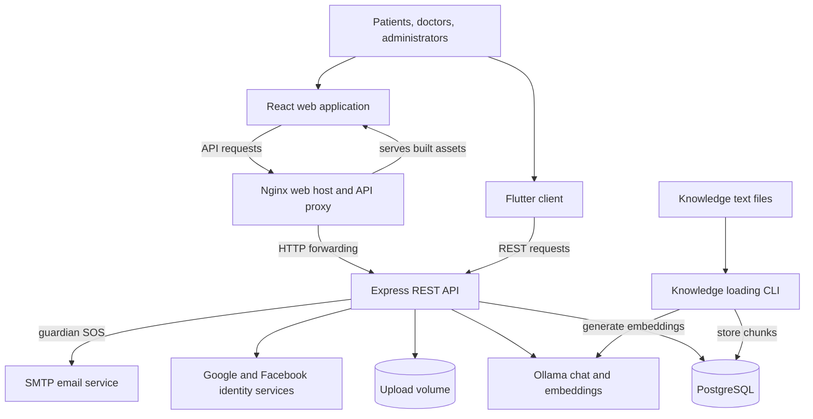
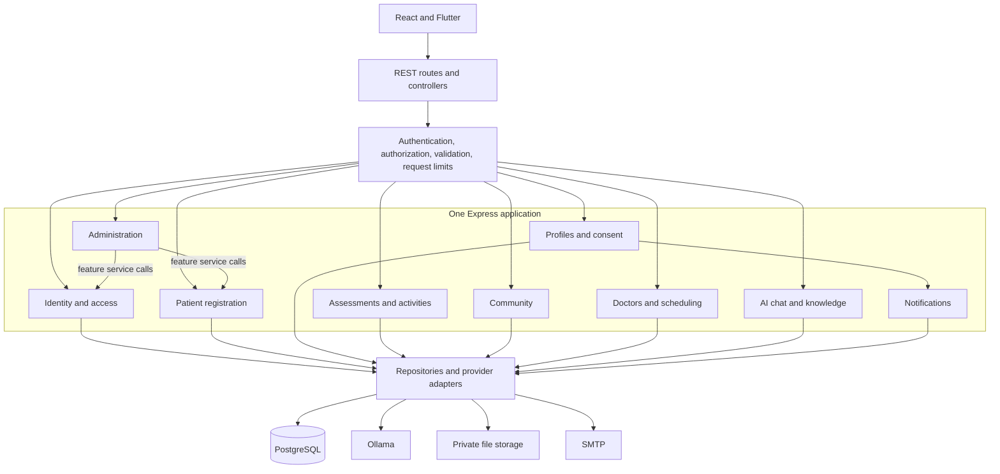
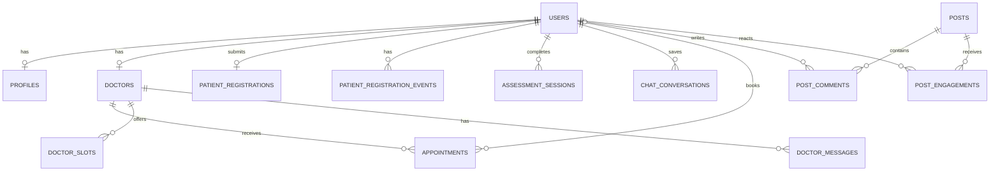
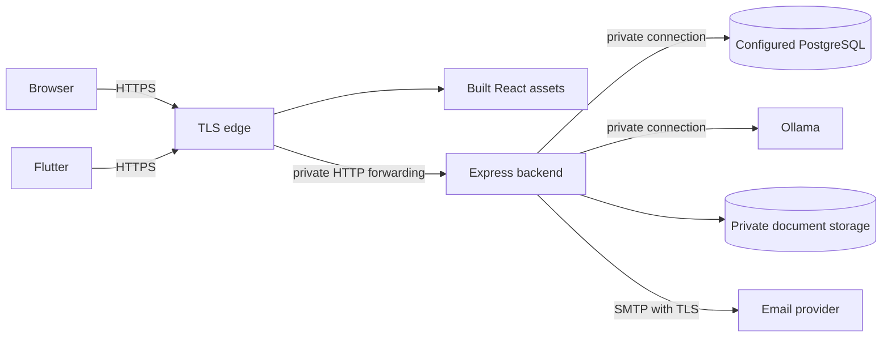

# MindBridge — current architecture baseline

Source inspection baseline · 3 October 2026

For the recommended target design, see [Architecture blueprint](ARCHITECTURE.md).

MindBridge has a React web application, a Flutter client, and a shared Express backend with PostgreSQL storage and Ollama inference. Its core workflows are account access, patient registration, profiles and consent, assessments, activities, community posts, doctor discovery, appointment booking, AI conversations, and SOS email notifications.

**Proposed architecture:** keep one backend deployment and organize it into feature modules with explicit service and repository boundaries. This is a modular monolith: independently understandable modules within one application. It fits the existing shared API and transaction-based workflows. Ollama remains a separate inference process.

This document distinguishes the current implementation from the proposed target. It changes documentation, not application behavior. Findings reflect source inspection, not a running deployment or a full security audit.

## 1. Current system



Production HTTPS is expected by the API. TLS termination and forwarding must be configured on the selected hosting platform. The knowledge search implementation also has a schema prerequisite gap described in section 7.

| Component | Responsibility | Implementation |
| --- | --- | --- |
| React + Vite | Web routes, dashboards, forms, patient workflows | `index.html`, `client/src/main.jsx`, `client/src/App.jsx` |
| Flutter | Additional client with patient screens and API services | `lib/main.dart`, `lib/screen/`, `lib/services/` |
| Express | Authentication, authorization, feature APIs and orchestration | `server/server.js`, `server/routes/` |
| PostgreSQL | Accounts, clinical/profile data, appointments, community, registration, audit records and knowledge | `server/migrations/`, `server/models/` |
| Ollama | Chat generation and embedding generation | `server/services/aiService.js`, `embeddingService.js` |
| Upload volume | Images and doctor application documents | Upload handlers and static `/uploads` serving |
| SMTP | Guardian SOS email | `server/routes/profileRoutes.js` |
| Socket.IO | Server initialization and proxy support | Empty connection handler in `server/server.js` |

The root checkout is canonical according to the current README and build configuration. The root web entry point uses `client/src/`, and the API entry point is `server/server.js`. Historical copies named `MentalHealthAssistant/` and `mentalhealth/` have been removed and remain ignored.

Socket.IO initialization does not establish a working realtime messaging feature. Payments and reports screens contain placeholder interfaces; they are outside the implemented backend scope. React and Flutter share the API, but this document does not assume complete feature parity.

## 2. Proposed backend boundaries



Logging, encryption, configuration and transaction utilities are shared capabilities used across modules; they are omitted from the diagram to keep feature relationships clear.

Dependency rules:

1. Routes declare HTTP paths and middleware. Controllers translate requests and responses without SQL or provider calls.
2. Feature services own workflow decisions, record-level authorization and transaction boundaries.
3. Repositories own SQL and row mapping. Provider adapters own Ollama, email and storage calls.
4. A module calls another module through its exported service interface, rather than importing its repository.
5. Shared code provides technical capabilities; feature rules stay within feature modules.
6. Backend authorization is authoritative. Client route guards control navigation only.

The existing routes/controllers/services/models arrangement is a starting point. Many routes still contain workflow logic and database calls. Existing models mostly act as SQL repositories. Extract services incrementally while preserving client contracts.

| Proposed module | Owns | Existing boundary |
| --- | --- | --- |
| Identity and access | Accounts, password/social login, JWT issuance, roles and permissions | `/api/auth/*`, user model, JWT and permission middleware |
| Patient registration | Submission, review, approval status and event history | `/api/registration/*`, registration model and middleware |
| Profiles and consent | Own profile, guardian contacts, onboarding and consent | `/api/profile/*`, `/api/patient/onboarding` |
| Assessments and activities | Scoring, stored results and activity catalogue | `/api/patient/assessments*`, `/api/patient/activities` |
| Community | Posts, comments, per-user likes and saves | `/api/patient/community/*`, community and post models |
| Doctors and scheduling | Directory, doctor profiles, slots, booking and appointment reads | `/api/doctor/*`, doctor and appointment models |
| AI chat and knowledge | Safety checks, retrieval, generation, moderation and conversation storage | `/api/chat`, `/api/public-chat`, `/api/save-conversation` |
| Notifications | SOS delivery and delivery outcomes | Currently inside `/api/profile/sos` |
| Administration | User management, doctor verification, audit views and review orchestration | `/api/admin/*` and registration review routes |

Preserve endpoint paths and Mongo-style `_id` mappings during restructuring. Create an OpenAPI contract covering payloads, responses, errors, roles, record ownership and approval requirements. Keep a future `/api/v1` migration separate from internal refactoring.

Current authentication supports an `auth_token` cookie and bearer tokens. The shared web request helper includes cookies; Flutter's API client attaches a securely stored bearer token. JWT middleware normalizes roles from the token. Patient approval gates patient routes except onboarding and also applies to doctor routes. The chat router has no approval gate. Pending-doctor accounts bypass the patient-specific approval check. Confirm those access distinctions before changing them.

## 3. Current data model

These relationships reflect checked-in foreign keys.



Registration records also reference the reviewer, and registration events reference the actor; these secondary relationships are omitted for readability. `audit_logs` stores actor identifiers without a foreign key. `knowledge_chunks` is independent of user records.

Storage characteristics:

- IDs are commonly text and mapped to `_id` in API output. Retain compatibility during structural changes.
- Selected profile, appointment and conversation fields use AES-256-GCM encrypted JSON envelopes. Registration details and review notes are encrypted as complete values.
- Encryption is selective. User account data, assessment responses and other fields are not universally encrypted by the helper. JSONB alone does not imply encryption.
- Audit and registration-event tables use triggers to prevent row updates and deletes. Privileged database operations remain outside that safeguard.
- Appointment dates and times are text. Future schema changes should define timezone semantics and typed scheduling values.
- Appointments have no slot foreign key or uniqueness constraint preventing duplicate slot bookings.
- Posts have no author user foreign key. Introduce explicit ownership if editing, deletion or moderation requires it.

## 4. Key workflows

### Patient registration — current

An authenticated patient submits validated details. The registration model encrypts them and commits the application, account name update and registration event together. Resubmission is allowed for `needs_information` or `declined` applications. An administrator reviews a submitted application using its version; a conditional update prevents stale decisions from overwriting newer versions. The decision and event commit together. Feature gates consult registration status in PostgreSQL.

### AI conversation — current

```mermaid
sequenceDiagram
    participant Client
    participant API as Chat API
    participant Safety as Safety checks
    participant Retrieval as Knowledge retrieval
    participant DB as PostgreSQL
    participant Ollama
    Client->>API: POST /api/chat with message and history
    API->>API: Authenticate, limit requests, check permission
    API->>Safety: PII filter, crisis detection, prompt guardrails
    alt Crisis or blocked input
        API-->>Client: Fixed safety response
    else Allowed input
        API->>Safety: Sanitize message and history; recheck guardrails
        API->>Retrieval: Retrieve knowledge context
        Retrieval->>Ollama: Generate question embedding
        Retrieval->>DB: Search matching chunks
        DB-->>Retrieval: Matches
        Retrieval-->>API: Context and source metadata
        API->>Ollama: Structured prompt with context and safe history
        Ollama-->>API: Generated text
        API->>Safety: Moderate response
        API->>DB: Audit retrieval metadata
        API-->>Client: Content and sources
    end
```

`/api/public-chat` skips authentication and uses a public limiter. Retrieval errors currently return empty context, allowing generation to continue. Returned sources identify retrieved chunks, without guaranteeing support for every generated statement. Chat generation does not automatically save the conversation; storage uses a separate authenticated `/api/save-conversation` request.

### Appointment booking — current and proposed invariant

Currently the model inserts an appointment and deletes a matching slot in a transaction. It does not check that deletion successfully claimed the slot. Two requests can therefore insert bookings without an exclusive slot claim.

The target scheduling service must enforce **at most one active booking per slot**, validate that the slot belongs to the requested doctor, and derive patient identity from the authenticated request. Lock or atomically claim the slot, insert the appointment and mark the slot booked within one transaction. Back the rule with a database constraint. Return `409 Conflict` for an unavailable slot and define idempotency for repeated client requests.

### SOS — current and proposed boundary

The profile route reads guardian details and sends an email through SMTP. Move delivery into a notification adapter with timeouts and explicit delivery results. Add persisted notification jobs if durable retries are required. Chat crisis detection currently returns a fixed response; it does not automatically send an SOS email.

## 5. Proposed repository organization

Introduce feature modules within existing directories first. Keep root build paths stable until each migration is verified.

```text
client/src/
  app/                    # routing, providers, startup
  features/               # auth, registration, patient, scheduling, chat, community, admin
  shared/                 # common UI, API transport, configuration
lib/
  app/                    # Flutter startup and routing
  features/               # mobile features
  shared/                 # API transport, token storage, common widgets
server/
  app.js                  # Express assembly
  server.js               # startup, readiness and shutdown
  modules/
    identity/
    registration/
    profiles/
    assessments/
    community/
    scheduling/
    chat/
    notifications/
    admin/
  shared/
    database/
    security/
    middleware/
    observability/
    config/
  migrations/
  scripts/
  tests/
docs/
  ARCHITECTURE.md
  api/                    # future OpenAPI contract
  decisions/              # future architecture decision records
```

A module can contain `routes.js`, `controller.js`, `service.js`, `repository.js` and validation rules. Add layers where they have responsibilities: a static activity catalogue needs no repository until it uses storage. Share API contracts and terminology between clients, while keeping framework-specific state and UI separate.

## 6. Deployment boundary



This is a proposed production boundary. The repository runs as direct local processes and does not prescribe a production packaging platform. A deployment must provide PostgreSQL, an AI provider, private file storage, and TLS termination.

The effective database is selected by `DATABASE_URL` first, then PostgreSQL environment variables. Hosted PostgreSQL is supported through the same configuration; root dependencies do not establish Supabase Auth or Storage.

Production decisions:

- Expose the HTTPS edge and keep backend, database and inference endpoints private. Choose one database destination explicitly.
- Verify forwarded scheme handling. The production backend rejects HTTP, so the TLS edge must work with Express proxy trust.
- Run versioned migrations as a controlled release step before starting a release.
- Pull the configured Ollama models explicitly during environment provisioning.
- Separate liveness from dependency readiness. The current `/health` handler only returns a static server-running response.
- Back up PostgreSQL, upload storage and encryption keys together with a tested recovery procedure.

## 7. Gaps and priorities

| Priority | Source evidence | Proposed improvement |
| --- | --- | --- |
| First | `knowledgeModel.js` uses `::vector` and `<=>`; `init_schema.sql` disables the vector extension and declares `embedding TEXT` | Provision a consistent vector-capable PostgreSQL runtime/schema, align embedding dimensions, migrate existing data and test knowledge loading/search. Treat retrieval as conditional until verified. |
| First | `/api/upload`, legacy `/api/posts` mutations and static `/uploads` serving have no authentication middleware | Define access policy, protect mutations and serve private doctor documents through authorized downloads. Separate public images from private documents. |
| First | Appointment insert/delete transaction lacks an exclusive claim check and booking uniqueness constraint | Enforce slot ownership and exclusive booking in service and database layers. |
| First | The production API requires HTTPS and trusted proxy configuration | Complete and test TLS termination and forwarding for the selected hosting platform. |
| Next | Clinical encryption relies on selected field names and call sites | Define field-level storage policy, verify assessment/onboarding coverage and design key rotation/recovery. |
| Next | JWT middleware uses token roles without a current-account lookup | Define token invalidation after role changes/logout and enforce current privileges for sensitive operations. |
| Next | Large route files contain workflow logic | Extract feature services and repositories incrementally. |
| Next | AI calls lack explicit timeouts; retrieval failures remove context silently | Set latency limits and define visible degraded behavior, including when retrieval must succeed. |
| Later | Empty Socket.IO handler and placeholder payments/reports | Add these only after requirements, ownership and API contracts are defined. |

The current main chat router uses the safety pipeline. Keep one supported chat path as the architecture evolves.

## 8. Refactoring plan and acceptance checks

1. **Baseline contracts and ownership.** Confirm client scope, inventory endpoints and record the role × operation matrix. Check historical copies for unique work before consolidation.
2. **Resolve prerequisites.** Align vector storage, enforce booking exclusivity, complete HTTPS forwarding and implement the agreed upload/post policy.
3. **Extract backend modules.** Begin with scheduling and registration, then profiles, assessments/community and chat. Preserve endpoint paths and `_id` output.
4. **Align clients.** Centralize API configuration and error handling; organize both clients by feature. Validate shared workflows without assuming feature parity.
5. **Strengthen operations.** Add controlled migrations, readiness checks, redacted logs, provider timeouts, key lifecycle handling and recovery checks.

Acceptance criteria for future implementation:

- Two concurrent requests for one slot produce exactly one booking; the other returns a conflict.
- Patients cannot book or read another patient's private records; approval gates follow the agreed role matrix.
- A fresh database can migrate, load knowledge and retrieve a known matching chunk using the configured embedding model.
- Crisis/blocked input avoids ordinary generation; history is sanitized; retrieval and generation errors follow defined behavior.
- Private uploads require authorized access, with a separate policy for public media.
- Role changes affect access according to the chosen session policy.
- React cookie requests and Flutter bearer requests work through the production-like HTTPS edge.
- Restored database, files and keys successfully recover encrypted records.

## 9. Decisions to confirm before implementation

- Are React and Flutter both required going forward?
- Should registration approval also gate AI chat, and what access should pending-doctor accounts retain?
- Will PostgreSQL and Ollama run locally or on hosted infrastructure?
- Are realtime messaging, payments and advanced reporting planned or out of scope?

These decisions refine the proposed target. The current architecture and immediate source-level gaps are documented independently of them.
