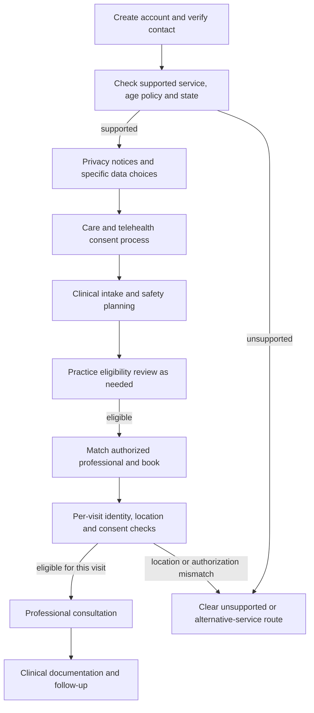

# MindBridge — U.S. clinical registration and onboarding specification

Version 1.0 · 3 October 2026 · Documentation only

**Confirmed scope:** United States as the primary market, with professional consultations and treatment. The general public seeking mental health support is the audience. The current project remains a prototype; these are proposed requirements, not implemented capabilities or a legal determination.

**Design decision:** separate account registration, clinical onboarding, and appointment check-in. An account is not the same as being eligible for care, giving informed treatment consent, or establishing that a professional may treat the patient in their location.

Launch states, provider disciplines, operating entity, clinical delivery modality, and clinical/legal owners are not yet specified. Therefore this document is a federal-baseline and state-review specification, not a complete fifty-state compliance assessment. Final forms and operating rules need review by qualified U.S. healthcare counsel and the responsible clinical lead for the chosen launch states.

## 1. Regulatory decisions before finalizing screens

| Decision | What must be resolved | Design consequence |
| --- | --- | --- |
| Operating model | Is MindBridge a care provider, a platform working for providers, or a marketplace with independent practices? | Identify the treating practice, record custodian, platform obligations and contractual responsibilities |
| HIPAA role | Determine covered-entity/business-associate status from actual activities and relationships | Configure applicable safeguards, patient notices and vendor agreements; do not treat “health app” as an automatic HIPAA classification |
| Supported states | Choose initial states and applicable professional/telehealth rules | State eligibility and consent versions drive enrollment, matching and check-in |
| Professional types | Physicians/psychiatrists, psychologists, licensed counselors, clinical social workers or other defined disciplines | Verify the relevant licensing board and authorized scope separately for each discipline |
| Age and consent | Define the supported adult population and state-specific consent-capacity rules | The current 18+ code restriction is a product baseline, not a universal legal conclusion; no minors pathway without a separate approved design |
| Care scope | Define modality, hours, suitability, emergency handling and prescribing scope | Show accurate expectations and enable only supported clinical functions |
| Privacy obligations | Assess federal and applicable state health-data/privacy requirements | Separate notices, permissions, rights handling, sharing and retention rules |

HIPAA applicability depends on the developer/provider relationship and whether the platform handles PHI on behalf of a covered entity. A BAA can be required in that arrangement; an app's access solely at an individual's direction does not itself establish that relationship. [HHS app/BAA guidance](https://www.hhs.gov/hipaa/for-professionals/faq/does-hipaa-require-a-covered-entity-to-enter-into-a-business-associate-agreement.html)

Non-HIPAA consumer-health functions still require analysis. The FTC Health Breach Notification Rule can cover qualifying personal-health-record vendors, related entities and service providers. Assess coverage from actual data capabilities and relationships, not from a disclaimer. [FTC coverage guidance](https://www.ftc.gov/business-guidance/resources/complying-ftcs-health-breach-notification-rule-0)

State requirements also matter. Washington's consumer-health law is one example with its own applicability, privacy-notice, collection/sharing and rights rules; it is not a substitute for reviewing other launch states. [Washington Attorney General guidance](https://www.atg.wa.gov/protecting-washingtonians-personal-health-data-and-privacy)

## 2. Patient screen sequence

The following is a proposed experience. The grouping and number of screens are design choices, not a federally mandated screen count. Clinical requirements must be satisfied before the relevant service, not indiscriminately forced into the first signup form. Telehealth-specific steps apply when care is delivered remotely; the actual delivery modality remains to be selected.

| ID | Screen | Content | Completion rule |
| --- | --- | --- | --- |
| P01 | Service and eligibility | Explain clinical care versus AI/wellbeing tools, current supported states, service availability and eligibility policy | Confirm the user is seeking a supported service; clearly route unsupported users |
| P02 | Create account | Email, user-chosen password, applicable terms; supported secure sign-in options | Server validates account data; no shared/default patient passwords |
| P03 | Verify contact and secure access | Email verification; phone verification if justified; recovery setup and authentication options | Record verified channel separately from legal identity verification |
| P04 | Patient identity and contact | Legal name, DOB, contact/callback number, residence details needed for care; preferred name/language as appropriate | Validate identity/eligibility under the practice policy; collect ID documents only when justified |
| P05 | Privacy and data choices | Platform privacy notice; treating practice's Notice of Privacy Practices where applicable; health-data collection/sharing choices required for the chosen model/state | Record the specific action and notice/consent version; do not merge acknowledgement with broad authorization |
| P06 | Care consent; telehealth consent when remote care is offered | Treating entity, service/modalities, relevant risks/limits, alternatives, confidentiality limits, communication boundaries and opportunity to ask questions | Complete the applicable state/practice-approved consent process before treatment; record clinician confirmation where required |
| P07 | Clinical intake | Clinician-approved reason-for-visit, relevant history, medications/allergies where appropriate, prior care and validated screening only where chosen by clinical lead | Explain purpose; protect data; route urgent responses through the defined clinical process |
| P08 | Safety and communication plan | Reliable callback, privacy during visit, emergency-contact approach, connection-loss plan and how urgent help differs from ordinary messages | Confirm the practice's approved plan; do not require an arbitrary trusted contact where an alternative is appropriate |
| P09 | Review and care eligibility | Editable summary, missing items, applicable fees/coverage disclosures, provider/service match | Show whether clinically/operationally eligible, needs follow-up, or unsupported; account creation alone never marks treatment approved |
| P10 | Dashboard and booking | Eligible professionals, actual availability, appointments, intake status and support options | Match state/service authorization and applicable patient eligibility |
| V01 | Before every clinical visit | Confirm identity, current physical location, callback number, consent status, provider authorization and emergency/disconnection plan | Re-evaluate session eligibility; pause or reroute when conditions are not satisfied |

Screens P04–P09 may be grouped into a saved clinical onboarding wizard. P01–P03 should not demand complete medical history. V01 repeats time-sensitive checks without asking patients to re-enter the entire intake.

For a booking marketplace that does not itself deliver treatment, ownership of clinical steps might lie with the treating practice. For the confirmed consultation/treatment goal, that responsibility must be assigned explicitly; it cannot be omitted.

## 3. Patient journey and independent states

Track these independently: `account_status`, `contact_verification_status`, `patient_enrollment_status`, `intake_status`, `consent_status`, `provider_credential_status`, `appointment_status`, and `visit_checkin_status`. Do not compress them into one `approved` flag.

Administrative review means paperwork/eligibility review under an approved policy; it does not establish diagnosis or suitability by itself. Any clinical suitability decision belongs to an appropriately qualified professional, following the practice's defined workflow.

## 4. Patient location and provider authorization

A residence address is not proof of where a patient is during a visit. Store residence for relevant administrative purposes and capture current physical location separately for each clinical encounter. Obtain a callback/contact plan without assuming IP geolocation reliably establishes location.

Before each visit, match the patient's current jurisdiction against the professional's valid authorization pathway and permitted service scope. HHS describes state licenses, temporary-practice rules, reciprocity, compacts and telehealth registration as possible pathways, and advises verifying patient location and consent before an appointment. The state-specific pathway must be validated; a single generic “U.S. approved doctor” flag is insufficient. [HHS interstate licensure guidance](https://telehealth.hhs.gov/licensure/licensing-across-state-lines)

## 5. Notices, consent and authorization are different

| Record | Meaning | Proposed evidence |
| --- | --- | --- |
| Terms acceptance | Agreement to the applicable platform/service terms | Terms version, actor, timestamp and acceptance action |
| Privacy-notice delivery | Information about how data is handled | Delivered notice/entity/version and delivery record |
| NPP receipt acknowledgement, where applicable | Acknowledges receipt of a covered provider's Notice of Privacy Practices | Signed/electronic acknowledgement or documented good-faith attempt as applicable |
| Telehealth/treatment consent | Informed process concerning the relevant service | Form/version, jurisdiction, discussion/confirmation and permitted documentation method |
| Specific disclosure authorization, when required | Permission for a defined disclosure/use | Recipient, information scope, purpose, required elements and revocation handling |
| Optional marketing/AI-history/research choice | Separate elective processing choice under the applicable model | Explicit purpose/version and change/withdrawal state |

A privacy notice is not a blanket treatment or disclosure authorization. HIPAA-covered providers with a direct treatment relationship generally must provide their NPP and make a good-faith effort to obtain written acknowledgement; failure/refusal to acknowledge must not automatically be treated as refusal of all care. [HHS NPP guidance](https://www.hhs.gov/hipaa/for-professionals/privacy/guidance/privacy-practices-for-protected-health-information/index.html)

HHS states that most states require official informed consent before telehealth treatment. It also explains that consent documents record an informed discussion, and documentation methods can include written, electronic or verbal consent. The legally permitted method and required content for MindBridge must follow the selected state/profession/practice rules; a universal checkbox is insufficient. [HHS telebehavioral consent guidance](https://telehealth.hhs.gov/providers/best-practice-guides/telehealth-for-behavioral-health/preparing-patients-for-telebehavioral-health/informed-consent-for-telebehavioral-health)

This specification does not supply final contractual or consent wording. Draft that wording only after the operating model and launch-state requirements are established.

## 6. Professional enrollment screens

Use “professional” as the umbrella role; distinguish discipline and clinical privileges in records and user-facing titles.

| ID | Screen | Review requirement |
| --- | --- | --- |
| D01 | Professional account and secure access | Verified contact, user-chosen credentials and stronger authentication |
| D02 | Identity and discipline | Legal/practice name, professional type and requested service scope |
| D03 | Licences and state authorization | Board, licence number, jurisdiction, status/expiry, discipline restrictions and any applicable compact/registration privileges |
| D04 | Qualifications and supporting evidence | Education/credentials relevant to discipline; private uploads; NPI if applicable |
| D05 | Practice and clinical operations | Treating entity, contact, coverage, liability/operating requirements and services/hours |
| D06 | Agreements and policy acknowledgements | Clinical responsibilities, platform/practice agreements and applicable privacy arrangements |
| D07 | Verification status | Needs information, approved scope, rejected, suspended or expired; review audit |
| D08 | Public profile and scheduling | Publish only after scope/state eligibility is approved; limit availability to eligible services |

Reviewers verify credentials against appropriate authoritative licensing sources, document the result and recheck expiry/status. An uploaded certificate or NPI alone is insufficient. CMS explicitly states that an NPI does not validate licensure or credentialing. [CMS NPI Registry](https://npiregistry.cms.hhs.gov/)

## 7. Emergency and communication planning

For clinical telebehavioral visits, the practice needs an emergency workflow covering the patient's current location, relevant local emergency contacts/resources, an authorized emergency-contact approach and a connection-loss plan. Record the plan in the appropriate clinical record and assign responsibility to the treating team. HHS provides corresponding planning guidance. [HHS telebehavioral emergency planning](https://telehealth.hhs.gov/providers/best-practice-guides/telehealth-for-behavioral-health/preparing-patients-for-telebehavioral-health/creating-a-telehealth-emergency-plan)

The app's email-based SOS and keyword response are not substitutes for that workflow. State accurate monitoring hours and message response expectations. Urgent screening responses must not disappear into an unmonitored administrative queue. A clinical lead must define routing, staffing and escalation before using screening for real care.

## 8. Architecture requirements behind the screens

- **Eligibility policy:** state, discipline, service, age/consent policy and versioned effective dates; no default nationwide availability.
- **Professional credentials:** multiple authorization records per professional, verified status/scope and expiry.
- **Consent records:** immutable/versioned evidence with distinct purposes; revocation and re-consent logic where applicable.
- **Clinical intake:** secure save/resume, purpose-limited access, clinician-approved validation and explicit urgent-response routing.
- **Encounter service:** per-visit location/identity checks, scoped consultation access, clinician documentation and follow-up.
- **Consultation adapter:** authorized short-lived session access and vendor review; no public meeting links or default recording.
- **Clinical records:** distinguish ordinary encounter/progress records from separately maintained psychotherapy notes; no automatic administrative or AI access.
- **Privacy operations:** access requests, corrections, applicable deletion/retention policy, incident response and vendor/data-flow inventory.

For covered providers using video/remote communication products, HHS identifies HIPAA-compliant vendors and appropriate BAAs as part of telehealth technology requirements. A locally hosted database or AI model alone does not establish these arrangements. [HHS telehealth technology guidance](https://telehealth.hhs.gov/providers/telehealth-policy/hipaa-for-telehealth-technology)

Psychotherapy notes have a specific HIPAA definition and additional disclosure protection, with exceptions. They are not synonymous with every therapy progress note, intake answer or chat transcript. Where such notes are maintained, model them separately and apply their specific access/disclosure policy. [HHS mental-health information guidance](https://www.hhs.gov/hipaa/for-professionals/faq/does-hipaa-provide-extra-protections-mental-health-information-compared-other-health.html)

## 9. Acceptance and legal-review checklist

Before finalizing clinical registration:

1. Confirm initial launch states, treating entity, professional disciplines and service modality.
2. Record the HIPAA/business-associate analysis and relevant vendor agreements; separately assess consumer-health/privacy obligations.
3. Approve each state's eligibility, consent, professional authorization and records requirements through qualified review.
4. Have the clinical lead approve intake, suitability/risk routing, emergency handling and follow-up responsibilities.
5. Show that unsupported state/service/location combinations cannot progress to an unauthorized clinical visit.
6. Demonstrate separate notice, consent, authorization and optional-choice records; support applicable refusal/withdrawal behavior.
7. Demonstrate that account creation does not grant access to another patient's records or mark someone clinically approved.
8. Verify care records, private documents and consultation links are accessible only within the approved scope.
9. Validate contact recovery, failed verification, stale submissions, save/resume, provider expiry and interrupted-visit paths.
10. Review the interface with representative users and accessibility checks, without using real clinical data in ordinary development tests.

**Open decisions:** launch states, treating entity, disciplines, prescribing scope, payment/insurance arrangements, vendor selection and monitoring responsibilities. Prescribing and controlled-substance workflows are outside this registration specification and require their own regulatory/clinical design if requested.
